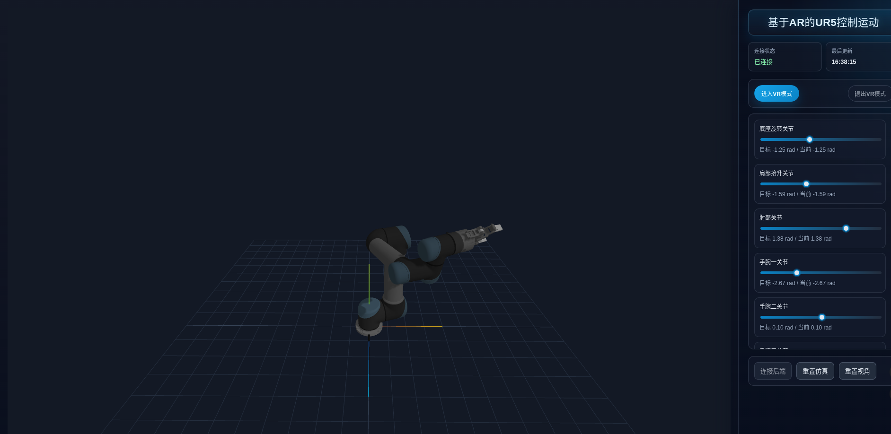
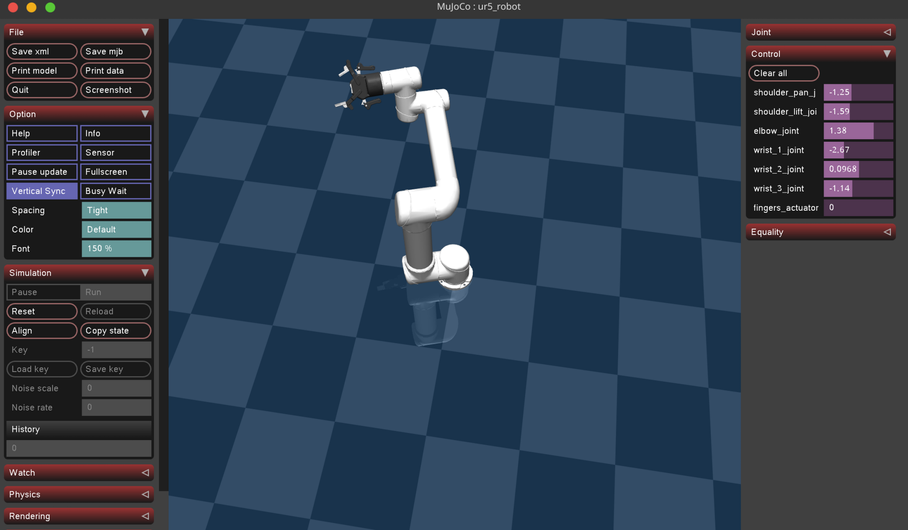

# AR-UR5

基于 MuJoCo + FastAPI + Vue 3 + WebXR 的 UR5 机械臂仿真与交互控制项目。  
项目支持桌面端控制与 Quest 3 浏览器访问，进入 VR 模式后可通过手柄控制机械臂关节与夹抓。

## 项目简介

本项目由两部分组成：

- 后端（`backend/`）：负责 UR5 仿真、状态更新、控制指令处理与实时推送
- 前端（`frontend/ur5-control/`）：负责 3D 可视化、控制面板、WebXR/VR 交互

核心能力：

- UR5 关节状态实时获取（REST + WebSocket）
- 6 轴关节目标角控制 + 夹抓开合控制
- Quest 3 局域网访问与 VR 模式进入
- 前后端实时同步，支持本地控制与 XR 手柄控制

## 目录结构

```text
ar-ur5/
├── backend/
│   ├── main.py                 # FastAPI + MuJoCo 仿真服务
│   ├── converter.py            # URDF -> MuJoCo XML 转换工具
│   ├── ur5_converted.xml       # MuJoCo 模型
│   └── doc/README.md           # 后端详细文档
├── frontend/
│   └── ur5-control/
│       ├── src/                # Vue 前端源码
│       ├── public/             # 模型与静态资源
│       ├── package.json
│       └── vite.config.ts      # HTTPS + LAN + /api 代理配置
├── task.md                     # 任务拆分记录
└── README.md                   # 项目总览（本文档）
```

## 环境要求

后端：

- Python 3.10+（建议 3.11/3.12）
- MuJoCo 运行环境
- 推荐依赖：`fastapi`、`uvicorn`、`mujoco`、`numpy`

前端：

- Node.js 18+（建议 20 LTS）
- npm 9+

设备与网络：

- Quest 3 与开发机位于同一局域网（建议 5GHz Wi-Fi）
- Quest 3 使用 Meta Quest Browser
- WebXR 需要安全上下文（本项目前端开发模式默认 HTTPS）

## 快速开始

### 1. 启动后端

在仓库根目录执行：

```bash
python -m venv .venv
source .venv/bin/activate
pip install fastapi uvicorn mujoco numpy
python backend/main.py
```

可选：启动 MuJoCo 可视化窗口

```bash
python backend/main.py --viewer
```

后端默认监听：`0.0.0.0:8000`

### 2. 启动前端

```bash
cd frontend/ur5-control
npm install
npm run dev
```

前端开发服务默认：

- HTTPS
- `0.0.0.0:3000`
- `/api` 代理到 `http://localhost:8000`
- 支持 `/api/ws/robot` WebSocket 代理

### 3. Quest 3 访问

1. 在终端查看 Vite 输出的局域网地址（例如 `https://192.168.x.x:3000`）
2. 在 Quest 3 浏览器打开该地址并信任证书
3. 在右侧面板点击“连接后端”
4. 点击“进入VR模式”
5. 在 VR 顶部面板可切换“手柄模式 / 手势模式”，并可随时“退出 VR 模式”

#### 手柄模式（Controller）

1. 在 VR 顶部切换到“手柄模式”。
2. 用左手柄选择关节组：
   - `Grip`：腕部组（`wrist_2` / `wrist_3`）
   - `Y`：前臂组（`elbow` / `wrist_1`）
   - `X`：大臂组（`shoulder_pan` / `shoulder_lift`）
3. 用右手摇杆控制当前关节组：
   - 摇杆上下：控制组内第一个关节
   - 摇杆左右：控制组内第二个关节
4. 用右手 `Trigger` 连续控制夹爪开合（按得越深开合越大）。

#### 手势模式（Hand Tracking）

1. 在 VR 顶部切换到“手势模式”，等待 HUD 显示 `输入源: hand`，并确认能看到手部模型。
2. 双手操作（推荐）：
   - 左手食指捏合：腕部组（`wrist_2` / `wrist_3`）
   - 左手中指捏合：前臂组（`elbow` / `wrist_1`）
   - 左手无名指捏合：大臂组（`shoulder_pan` / `shoulder_lift`）
   - 右手食指捏合并拖动：控制当前组两个关节（上下/左右对应两个关节）
3. 右手中指捏合控制夹爪，右手无名指捏合可进入精细模式（低速微调）。
4. 单手兜底（只有一只手被追踪时）：
   - 无名指轻捏：循环切换关节组（腕部 -> 前臂 -> 大臂）
   - 食指捏合并拖动：控制当前组
   - 中指捏合：控制夹爪
5. 若出现“看不到手”或追踪不稳定：
   - 保持双手在视野内，避免贴近摄像头或快速甩手
   - 保证环境光线充足
   - 在 Quest 设置中确认已启用 Hand Tracking

## 界面截图

前端：

后端：


## 开发说明

### 常用命令

前端：

```bash
cd frontend/ur5-control
npm run typecheck
npm run test
npm run build
```

后端：

```bash
python backend/main.py
```

### 后端接口概览

- `GET /`：健康检查
- `GET /state`：获取 6 轴关节 + 夹抓状态
- `POST /control`：发送控制命令（`target_angles` + 可选 `gripper_position`）
- `POST /reset`：重置仿真
- `GET /joint/{joint_name}`：获取单关节状态
- `GET /info`：获取模型信息
- `WS /ws/robot`：实时状态推送与实时控制

### 关键联调点

- 前端开发环境使用 `VITE_API_URL=/api`，避免 Quest 设备将 `localhost` 解析为自身
- VR 模式依赖 HTTPS，非安全上下文无法进入 `immersive-vr`
- 前端与后端支持 REST 与 WebSocket 双通道，实时控制优先走 WebSocket

## 部署说明

推荐生产部署方式：

1. 后端部署为独立服务（例如 systemd + uvicorn）
2. 前端执行 `npm run build` 生成静态文件
3. 使用 Nginx/Traefik 提供 HTTPS
4. 将 `/api/*` 和 `/api/ws/robot` 反向代理到后端 `:8000`

示例后端启动命令：

```bash
uvicorn backend.main:app --host 0.0.0.0 --port 8000 --workers 1
```

说明：

- MuJoCo 仿真包含状态共享与锁机制，建议先从单进程部署开始
- 若面向公网，建议收紧 CORS 与鉴权策略

## 变更记录

- 已完成 UR5 前后端实时同步与夹抓映射
- 已完成 Quest 3 局域网访问链路（HTTPS + API/WS 代理）
- 已完成 VR 会话接入与控制区界面优化
